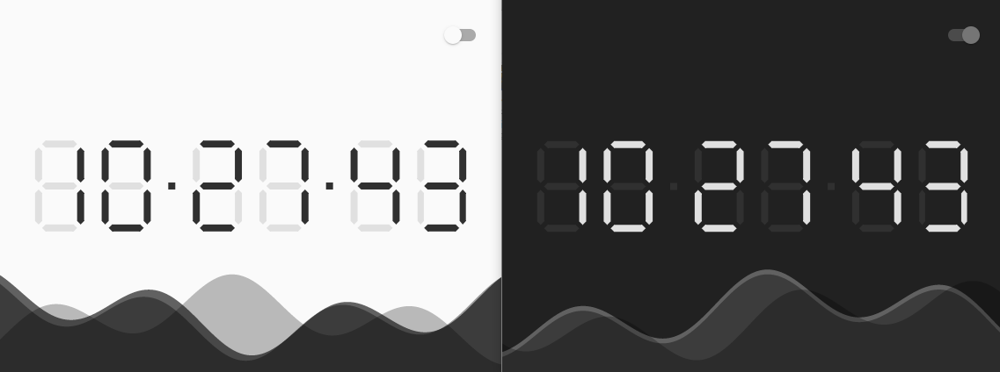

# digital_clock

A digital clock created on Flutter. This project is an example of implement graphic and animation purely without any 3rd party package.

<p float="left">
  

</p>

## Getting Started

### Clone this project and access it directory

```
git clone https://github.com/Cheersupzoo/digital_clock.git
cd digital_clock
```

### Install dependency

```
flutter pub get
```

### Run the app

```
flutter run
```

